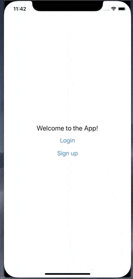
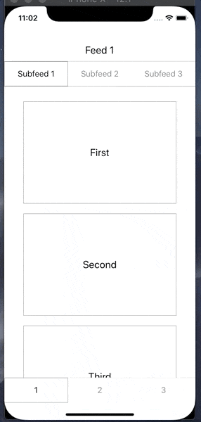
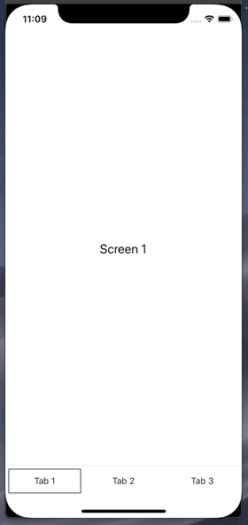
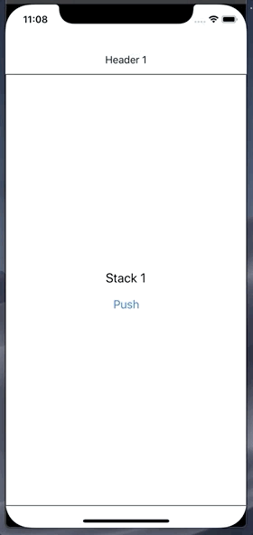
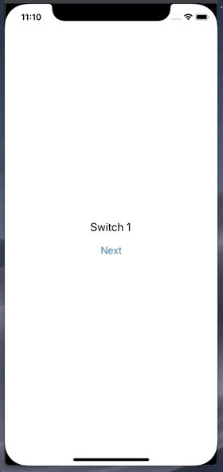
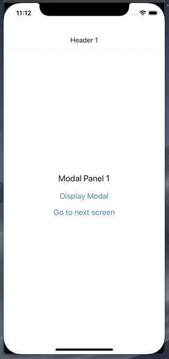
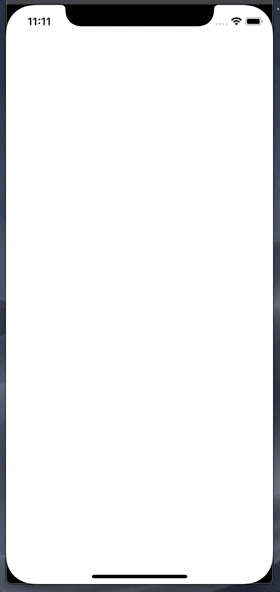

# react-native-navigation-components

A composable, flexible, and declarative API for your app's navigation.

The primitives in this library (try to) stay out of your way as much as possible and lay more responsibility on the user (you). There's only a few core components and a few basic behaviours to grasp, so the code you write is focused more on what you care about and are familiar with: your components. It's super composable, so nesting your navigators and mapping out your app is relatively straightforward.

Sound good? Let's look at some examples:

<p align="center">
  
  
</p>

<p align="center">
  <em>These aren't going to win any design awards, but hopefully you get the idea.</em>
</p>

# Install

`npm install --save react-native-navigation-components`

# Navigation Components

### Tabs

Here's what a basic tab navigator might look like:

```
import { Navigator, Tabs, TabBar, Tab } from 'react-native-navigation-components'

// note: the render prop is optional -- all child screens / header / tabbar components
// will receive the navigation prop implicitly

<Navigator name='my-tabs-navigator'>
  {({ navigation }) => {
    return (
      <View style={{ flex: 1 }}>
        <Tabs>
          <MyScreen title="Screen 1" />
          <MyScreen title="Screen 2" />
          <MyScreen title="Screen 3" />
        </Tabs>

        <TabBar>
          <Tab>
            <MyTab title="Tab 1" />
          </Tab>
          <Tab>
            <MyTab title="Tab 2" />
          </Tab>
          <Tab>
            <MyTab title="Tab 3" />
          </Tab>
        </TabBar>
      </View>
    )
  }}
</Navigator>
```

<p align="center">
  
</p>

Tabs will render in order and stacked horizontally

### Stack

...and here's a stack navigator:

```
import { Navigator, Header, Stack } from 'react-native-navigation-components'

<Navigator name='my-stack-navigator'>
  {({ navigation }) => {
    return (
      <View style={{ flex: 1 }}>
        <Header>
          <MyHeader title="Header 1" />
          <MyHeader title="Header 2" />
          <MyHeader title="Header 3" />
        </Header>

        <Stack>
          <MyScreen title="Stack 1"  />
          <MyScreen title="Stack 2" />
          <MyResetScreen title="Stack 3"/>
        </Stack>
      </View>
    )
  }}
</Navigator>
```

<p align="center">
  
</p>

Stack children will render one ontop of the other

### Switch

```
import { Navigator, Switch } from 'react-native-navigation-components'

<Navigator name='my-switch-navigator'>
  <Switch>
    <MyScreen title="Switch 1" />
    <MyScreen title="Switch 2" />
    <MyScreen title="Switch 3" />
    <MyResetScreen title="Switch 4" />
  </Switch>
</Navigator>
```

<p align="center">
  
</p>

Switch will only mount one screen component at a time

### Navigator

You can listen for navigation changes via the onNavigationChange callback, and pass some other initial props to a Navigator:

```
class App extends React.Component {
  state = {
    activeIndex: 0,
    navigation: {},
  }

  handleNavigationChange = (updatedNavigation: Navigation) => {
    this.setState({
      activeIndex: updatedNavigation.activeIndex,
      navigation: updatedNavigation.navigation,
    })
  }

  render() {
    return (
      <Navigator
        name='my-stack-nav'
        screens={['hi', 'hey']}
        initialState={{ test: 'value' }}
        initialIndex={1}
        onNavigationChange={this.handleNavigationChange}
        animated={false}
      >
        {({ navigation, activeIndex, activeScreen }) => {
          return (
            <Stack>
              <MyFormScreen title="Hi" onSubmit={(formValues) => navigation.push({ formValues })} />
              <MyScreen title="Hey" formValues={navigation.state.formValues} />
            </Stack>
          )
        }}
      </Navigator>
    )
  }
}
```

You can also turn animations off -- this can be useful if you want a slightly faster development workflow.

### Modal

```
import { Navigator, Stack, Modal, Header } from 'react-native-navigation-components'

<Navigator name='my-modal-navigator'>
  {({ navigation }) => {
    return (
      <View style={{ flex: 1 }}>
        <Header>
          <MyHeader title="Header 1" />
          <MyHeader title="Header 2" />
          <MyHeader title="Header 3" />
        </Header>

        <Stack>
          <MyScreen title="Modal Panel 1" onPress={() => navigation.modal.show('first-modal', { title: 'hello' })} />
          <MyScreen title="Modal Panel 2" onPress={() => navigation.modal.show('third-modal')} />
          <MyScreen title="Modal Panel 3" onPress={() => navigation.modal.show('second-modal')} />
        </Stack>

        <Modal>
          <MyModal name='first-modal' title={navigation.state.title} />
          <MyModal name-'success-modal' title="Modal for Panel 2" />
          <MyModal name='third-modal' title="Modal for Panel 3" />
        </Modal>

      </View>
    )
  }}
</Navigator>
```

<p align="center">
  
</p>

That's about it! Note that each of the accessory components in the examples above (Header, TabBar, Tab, etc) are composable, meaning you can mix and match and render in any combination that you'd like, depending on your needed use case.

# Navigation prop

Navigating around is (hopefully) fairly similar to what you're used to:

```
navigation: Navigation {
  back: (data: any) => void  // - return to the previously rendered screen
  pop: (data: any) => void // - navigate to the previous child screen
  push: (data: any) => void // - navigate to the next child screen
  select: (index: number, data: any) => void // navigate to child at index
  navigate: (routeName: string, data: any) => void // navigate to child via 'name' prop
  reset: () => void, // reset navigation to its initial state
  state: {}: any, // any object you want to share with your navigator children
  modal: {
    active: boolean,
    show: (name: string, data: any) => void, // toggle modal (on) by name prop
    dismiss: (name: string, data: any) => void, // toggle modal (off) by name prop
  }
  parent?: (navigation: Navigation) // defined in nested navigators
}
```

### Using `navigation.navigate()`

Navigating using route names requires name props for your screens, _or_ an array of screen names passed to the Navigator:

```
import { Navigator, Header, Switch } from 'react-native-navigation-components'
<Navigator>
  {({ navigation }) => {
    return (
      <View style={{ flex: 1 }}>
        <Header>
          <MyHeader title='Screen 1' onPress={() => navigation.navigate('second')} />
          <MyHeader title='Screen 2' onPress={() => navigation.navigate('third')} />
          <MyHeader title='Screen 3' onPress={() => navigation.navigate('fourth')} />
          <MyHeader title='Screen 3' onPress={() => navigation.reset()} />
        </Header>

        <Switch>
          <MyScreen name='first' navigate={() => navigation.navigate('third', { someData: 'hello there' })} />
          <MyScreen name='second' navigate={() => navigation.navigate('fourth')} />
          <MyScreen name='third' navigate={() => navigation.navigate('second')} />
          <MyResetScreen name='fourth' navigate={() => navigation.navigate('first')} reset={() => navigation.reset() />
        </Switch>
      </View>
    )
  }}
</Navigator>
```

# Other Stuff

### Animation and styles

Each of your defined screens are provided default animation and styles out of the box. They can be configured with animation and style props. You can also pass styles and animation configurations to all of the screens in your navigator (see Stack instance below)

```
import { Navigator, Stack } from 'react-native-navigation-components'

<Navigator>
  <Stack
    style={{ position: 'absolute', top: 20, left: 0 }}
    transition={{ ... }}
    screenStyle={{ backgroundColor: 'white' }}>

    <MyScreen
      title="Screen 1"
      transition={{
        config: {
          timing: Animated.spring,
          stiffness: 100,
          damping: 200,
          mass: 3,
          overshootClamping: true,
          restDisplacementThreshold: 0.01,
          restSpeedThreshold: 0.01,
        },
        configIn: {
          mass: 100
        },
        configOut: {
          mass: 200
        }
        animation: animatedValue => {
          return [
            {
              translateY: animatedValue.interpolate({
                inputRange: [0, 1],
                outputRange: [1000, 75],
              }),
            },
          ]
        }
      }}
    />

    <MiniScreen
      title="A mini screen"
      style={{
        position: 'absolute',
        left: 30,
        right: 30,
        top: 100,
        bottom: 100,
        borderWidth: 1,
      }}
    />
  </Stack>
</Navigator>
```

<p align="center">
  
</p>

### Header and TabBar

```
import { Header, Navigator, Stack, TabBar, Tab } from 'react-native-navigation-components'

<Navigator>
  {({ navigation }) => {
    return (
      <View style={{ flex: 1 }}>
        <Header hidden={this.state.tabbarHidden} style={{ height: 100, padding: 20 }}>
          <View hidden> // hides parent header
          <MyHeader title='Header 2" goBack={() => navigation.pop()} />
        </Header>

        <Stack>
          <MyScreen title='Screen 1 -- I have no header'>
          <MyScreen title='Screen 2'>
          <MyScreen title='Screen 3 -- I have no header'>
          <MyScreen title='Screen 4 -- I have no header'>
        </Stack>

        <TabBar hidden={this.state.tabbarHidden} style={{ position: 'absolute', top: 20, left: 0 }}>
          <Tab>
            <MyTab title="Tab 1" /> // MyTab receives 'active' prop
          </Tab>
          <Tab>
            <MyTab title="Tab 2" />
          </Tab>
          <Tab>
            <MyTab title="Tab 3" />
          </Tab>
        </TabBar>
      </View>
    )
  }}
</Navigator>
```

Each header child element is mapped to a screen based on ordering -- so you declare what header component is rendered for each screen. Each child can be toggled with the `hidden` prop.

# Testing

One strength of this library is that you can write end to end and integration tests

This library uses Animated apis -- if you're testing with jest, you might need to mock them out in your setup file:

```
jest.useFakeTimers()

jest.mock('Easing', () => {
  return {
    _bezier: jest.fn(),
    _easing: jest.fn(),
    inOut: jest.fn(),
    out: jest.fn(),
    poly: jest.fn(),
    linear: jest.fn(),
    in: jest.fn(),
  }
})

jest.mock('Animated', () => {
  return {
    View: props => (props.children ? props.children : null),
    Value: jest.fn(() => {
      return {
        interpolate: jest.fn(),
      }
    }),
    spring: jest.fn(() => {
      return {
        start: jest.fn(callback => {
          callback()
        }),
      }
    }),
    timing: jest.fn(() => {
      return {
        start: jest.fn(callback => {
          callback()
        }),
      }
    }),
  }
})

jest.mock('NativeAnimatedHelper')

```

If you're trying to narrow down the active screen, each navigator will expose a testID that you can query for like so: `queryByTestId('{my-navigator-name}-active-screen')` -- this might be useful to snapshot or peek into whats going on as you write your tests.

# WIP

Some features aren't implemented (yet):

- deep linking
- gesture support

# Acknowledgements

The inspiration for this API came from watching [Ryan Florence's lectures](https://reach.tech), specifically the lectures he's done on Tabs components. So, thank you Ryan!

Committing to a navigation library can have a large impact on how you architect your app, but this library is pretty small and you can incrementally adopt it, and I hope that you do!

I'm sure I have missed a ton of stuff, so do not hesitate and reach out
